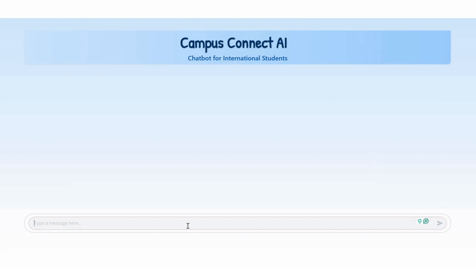

# Campus-Connect-AI: BorealisAI Let's Solve it 2025

## Interface Demo

  

## The Problem 
International students often face challenges when transitioning to a new country, including navigating unfamiliar environments, understanding local customs, managing administrative tasks, and accessing essential resources such as housing, healthcare, immigration policies, and financial services. Canada had 1,040,985 international students at all levels of study at the end of 2023 [1], reflecting the growing demand for better support systems. Additionally, the number of study permit holders with a valid permit in Canada from 2000 to 2022 has increased significantly [1], highlighting the increasing need for accessible resources.

A machine learning-powered chatbot can provide personalized, real-time assistance tailored to students’ needs. Due to its NLP-driven nature, we will aim to enable multilingual support, allowing students to communicate in their native language. Additionally, the chatbot will have a recommendation system that suggests healthcare services, immigration documents, transit information, and related FAQs, housing, dining, study spots, and events based on user preferences and past interactions. Automated information retrieval will provide instant answers by indexing university policies, FAQs, and local guides. The chatbot will incorporate adaptive learning, improving responses over time based on user interactions and feedback. Event and deadline reminders will integrate university calendars to send alerts for registration deadlines, visa renewals, and campus events.

## Type of Data
* Healthcare 
* Transit 
* Immigration 
* Reddit university data

## The Goal
Our goal is to create a chatbot that serves as an intelligent, centralized resource for international students. It will provide instant, relevant, and accurate assistance using Retrieval Augmented Generation (RAG), and potentially fine-tuning, helping students navigate their new environment with ease. Through continuous improvement and expansion, we aim to establish a comprehensive support system that enhances student well-being and fosters a more inclusive academic community.

## Sources so Far
[[1] - CBIE Infographic](https://cbie.ca/infographic/)

## Team members: 
* Ayana Hussain: ayanahye
* Poorvi Bhatia: notpoorvi
* Serena Dhillon: sakdhillon
